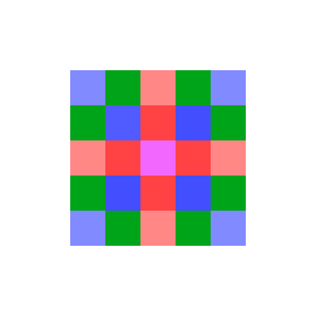
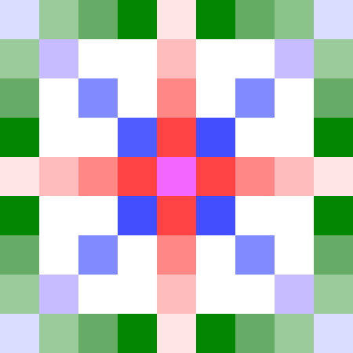

# Spiral Sequences 'distance:*'

Return sequence coordinates in spiral order. Start from (0,0). 
Variant 'distance:clockwise' of spiral sequence continue with 
top (0,-1), right (1,0), bottom (0,1) and left (-1,0). Then 
top-right (1,-1), bottom-right, ...

## Example for 'distance::clockwise'

Variant 'distance::clockwise' starts with 0,0 and continue with most 
nearby elements in clockwise order. Note that for example distance 
from 0,0 to 1,0 is shorten than to from 0,0 to 1,1 as 
(1^2+0^2)^1/2 <(1^2+1^2)^1/2. 

The first five elements
```
           2
         5 1 3
           4  
```

next four
```
         9 2 6
         5 1 3
         8 4 7
```

and all others to fill 5x5 matrix.
```
    25 21 10 14 22
    20  9  2  6 15
    13  5  1  3 11
    19  8  4  7 16
    24 18 12 17 23

```

## Example for 'distance::x-y'

Order 'x-y' start in top-left corner (minimal value of 'x' and minimal
value of 'y'), continue raising 'x' first and 'y' later.

Basical this is useful in case you would like to process two dimensional
array that is serialize to one dimensional (Buf) as [x,y] so
```
[0,0],..,[$x.end,0],[0,1],..,[$x.end,$y.max]
```
.

The first five elements
```
           2
         3 1 4
           5
```

next four
```
         6 2 7
         3 1 4
         8 5 9
```


## Algorithm explanation

Lets start with hardcoded begin of the sequence: magenta, red, blue.


We can continue with 4x red, 4x blue, 8x green



but let's first skip two layers to visualize the pattern clearly. You 
see 4x red will be the first and 4x blue the last. It's the same also
one, two or more steps from the core.


Lets skip to the outer most layer first to visualize that we have again
eight dark green positions. And near them also two more free space
before we read the blue corner.


And before we reach the blue corner there are also normal green and
light green positions.



Now we can return back to see that dark green emerged two layers sooner.
Whole pattern and algorithm is visualized by colors in these order:
magenta, red, green from dark to light and finally blue.


Now finally simplified ('clockwise' order only) Raku Perl 6 
implementation of the core loop as can be found in
[Algorithm::SpiralMatrix](../lib/Algorithm/SpiralMatrix.rakumod):

```perl6
unit module Algorithm::SpiralMatrix;

multi sub square3x3-reds-order('clockwise') {
    ( 0,-1), ( 1, 0), ( 0, 1), (-1, 0);
}
multi sub square3x3-blues-order('clockwise') {
    ( 1,-1), ( 1, 1), (-1, 1), (-1,-1);
}
multi sub big-squares-reds-order('clockwise', $shift) {
    (0,-$shift), ($shift,0), (0,$shift), (-$shift,0);
}
multi sub big-squares-greens-order('clockwise', $shift, $tone) {
                       (+$tone, -$shift),
    (+$shift, -$tone), (+$shift, +$tone),
    ( +$tone,+$shift), ( -$tone,+$shift),
    (-$shift, +$tone), (-$shift, -$tone),
    ( -$tone,-$shift);
}
multi sub big-squares-blues-order('clockwise', $shift) {
    ($shift,-$shift), ($shift,$shift), (-$shift,$shift), (-$shift,-$shift);
}

sub square_distance(
   :$order = 'clockwise'
) is export {
   # See docs/distance-variants.md to understand the algorithm
   # and the colors in comments below.
   gather {
        # 1x1
        take (0,0); # magenta

        # 3x3
        take $_ for square3x3-reds-order($order); # red
        take $_ for square3x3-blues-order($order); # red

        # 5x5, 7x7, ...
        my $shift = 2;
        loop {
            take $_ for big-squares-reds-order($order,$shift); # red
            for 1..^$shift -> $tone {
                take $_ for big-squares-greens-order($order,$shift,$tone); # green tone
            }
            take $_ for big-squares-blues-order($order,$shift); # blue
            $shift++;
        }
    }
}
```
