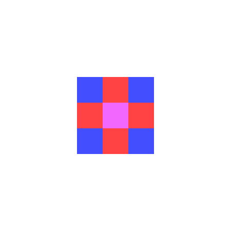
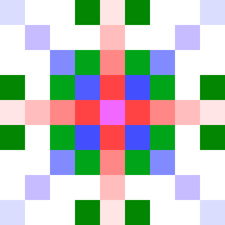

Intro
-----
Just return sequence coordinates in snail/spiral order. Start 
from  (0,0). Continue with top (0,-1), right (1,0), bottom (0,1) and 
left (-1,0). Then top-right (1,-1), bottom-right, ...

Basically you need to follow the pattern

````
           2
         5 1 3
           4  

         9 2 6
         5 1 3
         8 4 7

    25 14 10 15 22
    21  9  2  6 16
    13  5  1  3 11
    20  8  4  7 17
    24 19 12 18 23
````

Solution
--------
Lets start with hardcoded begin of the sequence: magenta, red, blue.



We can continue with 4x red, 4x blue, 4x green 


but let's first skip two layers to visualize the pattern clearly. You 
ee the 4x red will be the first and the 4x blue the last also one and 
two steps from the core.  


So lets skip on the outer most layer first to visualize that instead of
four point we have now eight (so 8x dark green).



And before we reach the blue there are also 8x middle green and 
8x light green.


Now we can return back to see that dark green emerged two layers sooner.


